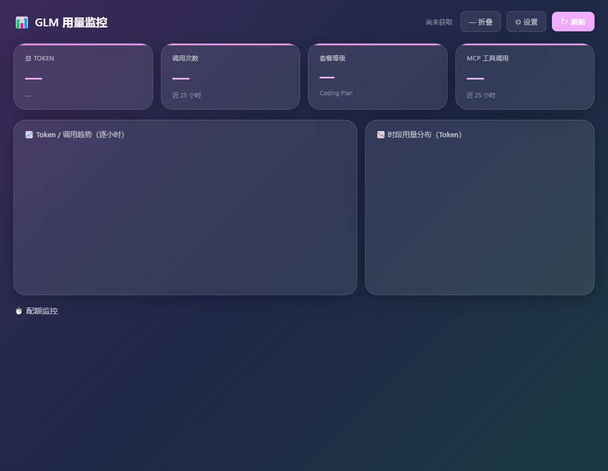
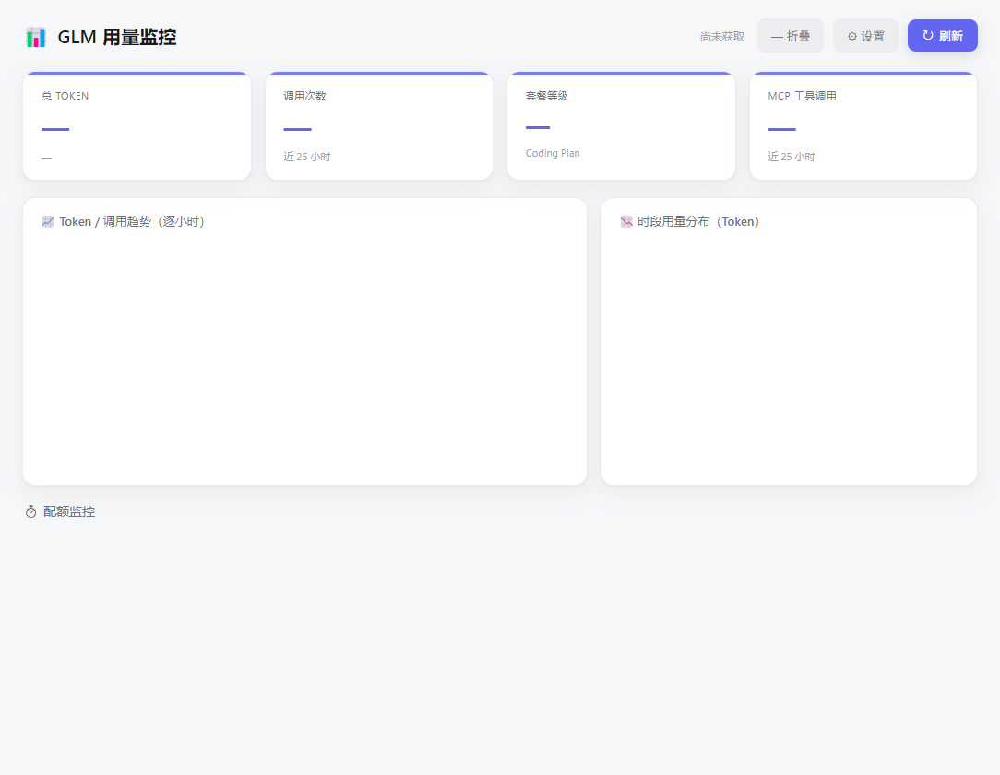

# GLM 用量监控 (GLM Usage Monitor)

实时监控 **GLM Coding Plan** 配额与用量的开源桌面小工具（Windows）。





> 任何购买了智谱 / Z.ai GLM Coding Plan 的用户，填入自己的 Token 即可使用——**不依赖 Claude Code，不读取任何本地配置文件**。

## ✨ 特性

- 🟢 **悬浮球常驻桌面** —— 一眼看到 5 小时窗口额度百分比，颜色随用量变（绿→黄→红），可拖动、位置记忆
- 🖥 **大屏详情** —— 趋势折线 / 时段柱状图 / 配额进度环，双击直接展开
- 🎨 **双皮肤切换** —— 浅色清爽 / Apple 毛玻璃，设置里即时切换并记住
- 🔔 **临近限额系统通知** —— 配额 ≥80% 自动弹系统通知（不刷屏）
- ⏱ **配额精确区分** —— 5 小时窗口 / 周窗口 / MCP 月度，带下次重置倒计时
- 🔒 **单例运行** —— 不会开多个；系统托盘可显示/隐藏悬浮球、真正退出
- 🔐 **Token 仅存本机**（`%AppData%`），绝不上传

## 🚀 快速开始（普通用户）

1. 下载 [Releases](../../releases) 中的 `GLM用量监控.exe`（便携版，无需安装）
2. 双击运行 → 显示大屏
3. 点右上角「⚙ 设置」→ 填入 GLM Coding Plan Token（+ 选主题）
4. 悬浮球常驻桌面，随时瞄一眼额度

## 🔑 获取 Token

1. 访问 [open.bigmodel.cn](https://open.bigmodel.cn)（国内）或 [z.ai](https://z.ai)（国际）
2. 开通 **GLM Coding Plan** 套餐
3. 在控制台创建 / 查看 API Key（格式 `xxxxxxxx.yyyyyyyy`）
4. 粘贴进应用「设置 → Token」

## 🛠 开发

```bash
npm install        # 安装依赖（自动拷贝 echarts 到 renderer/lib）
npm start          # 本地运行
npm run dist       # 打包便携 exe（输出 build/）
node scripts/gen-ico.js   # 从 OIP-C.webp 重新生成图标（改图后执行）
```

### 技术栈

| 层 | 技术 |
|----|------|
| 主进程 | Electron（Node.js） |
| 桥接 | preload + contextBridge（contextIsolation） |
| 渲染 | 原生 HTML/CSS/JS + CSS 变量双主题 |
| 图表 | ECharts 5 |
| 打包 | electron-builder（portable） |

### 目录

```
src/
├── main.js            # 主进程：单例/悬浮球/大屏/托盘/通知/IPC
├── preload.js         # contextBridge 安全暴露 API（区分球/大屏）
├── api/
│   ├── usage.js       # 调用智谱 monitor 接口，规整数据
│   └── config.js      # 读写 userData/config.json（token/endpoint/主题/球位置）
└── renderer/
    ├── index.html / styles.css / renderer.js   # 大屏（双皮肤）
    ├── ball.html / ball.css / ball.js          # 悬浮球
    └── lib/echarts.min.js                       # postinstall 自动拷贝
```

## 📡 数据源

直接调用智谱官方监控接口（与官方 `glm-plan-usage` 插件同源，但本工具独立实现、不依赖该插件）：

- `…/api/monitor/usage/model-usage`
- `…/api/monitor/usage/tool-usage`
- `…/api/monitor/usage/quota/limit`

认证头：`Authorization: <你的Token>`

## 🔒 隐私

- Token 仅存本机 `%AppData%\GLM用量监控\config.json`，**绝不上传**
- 只向你选择的智谱/Z.ai 端点发起请求，无任何第三方上报
- 主进程 `contextBridge` 严格隔离，渲染层无法直接访问文件/网络

## 📄 License

[MIT](LICENSE)，欢迎自行修改、分发、二次开发。
